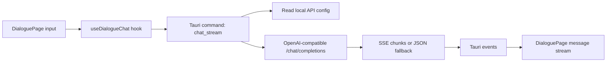

# M3 LLM Chat Module Plan

Last updated: 2026-05-28

## Goal

Build the first useful API-backed chat loop for the separate dialogue workspace.

M3 is intentionally small:

- Daily chat and lightweight question answering.
- OpenAI-compatible chat completion API.
- Streaming text display when the provider supports it.
- System prompt loaded from a project prompt file.
- Basic image payload shape reserved for M4 screenshot handoff.

M3 is not a research workspace, file assistant, or polished character system.

## Boundaries

- The pet bubble remains a status display and launcher.
- The dialogue window is the real chat surface.
- API key, model, and base URL are configuration values, not default chat content.
- Token usage should not be shown in the chat page. It can be recorded or displayed later in a pet management/settings surface.
- The chat UI should stay themeable for a future Rina Board presentation.

## Configuration

Initial configuration is file/environment based.

Supported values:

```text
OURDESKPET_API_KEY
OURDESKPET_BASE_URL
OURDESKPET_MODEL
OURDESKPET_MODEL_OPTIONS
OURDESKPET_SYSTEM_PROMPT
OURDESKPET_PROMPT_FILE
OURDESKPET_ENV_FILE
```

Model names are provider-owned strings. The app should not translate or validate them against a fixed vendor table. For a proxy provider, put the exact model id shown by that provider into `OURDESKPET_MODEL`.

Future settings UI can read `OURDESKPET_MODEL_OPTIONS` as a comma-, semicolon-, or newline-separated candidate list, then write the chosen value back to `OURDESKPET_MODEL`.

## Future Settings Notes

The likely long-term configuration model is:

- One provider profile can contain one API key and one base URL.
- The same provider profile can expose multiple model names.
- The current active model is a separate choice from the stored key.
- API keys should be write-only in the normal UI: the user can replace them, but the app should not reveal the saved value.
- Model names should remain free-form because proxy providers often use custom ids.
- A settings UI may offer a dropdown from `OURDESKPET_MODEL_OPTIONS`, plus a manual input for providers not yet listed.

For example:

```text
Provider profile:
  base_url = https://proxy.example.com/v1
  key = stored privately
  model_options = model-a, model-b, model-c

Current chat:
  active_model = model-b
```

This avoids tying a key to only one model and keeps proxy switching flexible.

Default prompt file:

```text
E:\OurDeskPet\prompts\rina_system_prompt.md
```

Example configuration file:

```text
E:\OurDeskPet\.env.example
```

The app should never display the API key in the normal chat flow.

## Data Flow



## M3 Implementation Steps

1. Add prompt/config files and this module plan.
2. Add Rust-side config loading and OpenAI-compatible request code.
3. Emit streaming deltas from Rust to the dialogue window.
4. Replace the placeholder dialogue page with a real chat UI.
5. Keep token usage out of the chat surface.
6. Reserve image payload types for future screenshot handoff.
7. Verify build and basic no-key error behavior.

## M3 Exit Checks

- API base URL is configurable.
- Model name is configurable.
- API key is configurable and not hardcoded.
- User can send a text message after configuration.
- Response text appears in the dialogue thread.
- Streaming works, or non-streaming JSON fallback is handled.
- Missing or failed API configuration gives a clear error.
- Conversation can be cleared.
- System prompt is applied.
